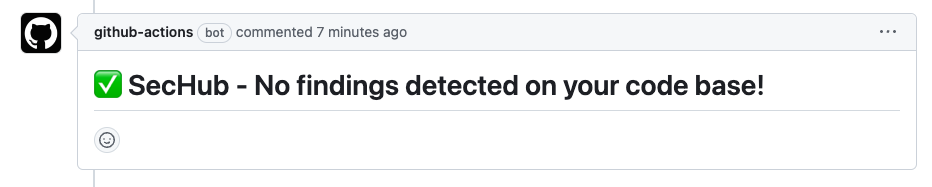
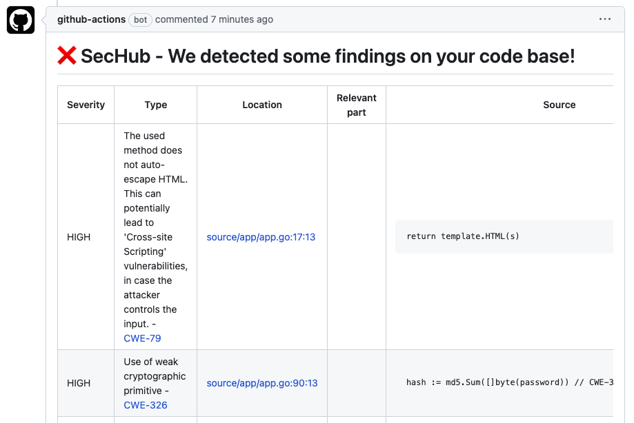
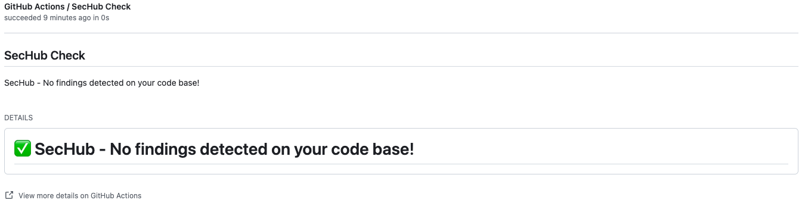
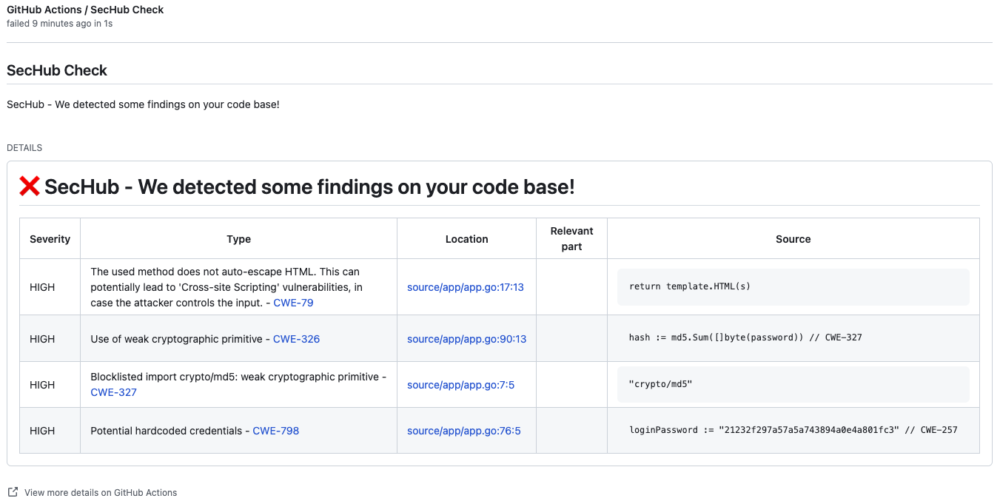
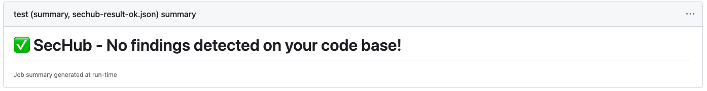
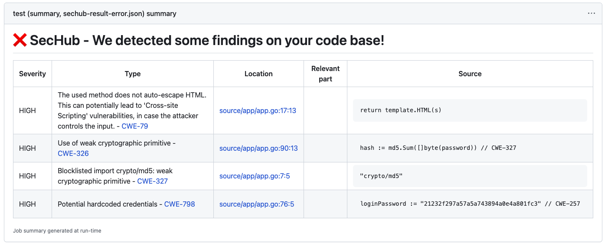

[sechub]: https://github.com/mercedes-benz/sechub
[test-badge]: https://github.com/tvcsantos/sechub-reporter-action/actions/workflows/test.yml/badge.svg

# SecHub Reporter Action

![test workflow][test-badge]

## Overview

This action aims to provide support for generating reports for [SecHub][sechub], a central API to test software with
different security tools.

Several output modes are supported depending on the user input and if the action is run on a pull request:

- `pr-comment` - report will be added as a comment on PR.
- `check` - report will be added in a GitHub check.
- `summary` - report will be added as a summary.

### Examples

Below we illustrate examples of expected outputs depending on the report mode.

#### Mode `pr-comment`

> ℹ️ By default when the action runs with `pr-comment` mode in a non pull-request context this mode will be ignored and
> if no additional mode was provided we will produce a report using `check` mode .

When running in `pr-comment` mode in case of no errors found you will get a comment in you pull request that should look
as follows



If errors are found then a nice table will appear in a form of pull request comment highlighting all the important
details for the report as in the example below



#### Mode `check`

When running in `check` mode a GitHub check will be created to add the report. In case of no errors found your check
will succeed, and you will get something as follows



If errors are found, the GitHub check will fail, and you will obtain the following



#### Mode `summary`

When running in `summary` mode a summary will be created with the following if no errors are found



And in case of errors with the following



## Changelog

All notable changes to this project are documented in [`CHANGELOG.md`](CHANGELOG.md).

## Usage example

```yaml
on:
  push:
    branches:
      - main

jobs:
  build:
    name: Build 
    runs-on: ubuntu-latest
    steps:
      - name: Do SecHub report
        uses: tvcsantos/sechub-reporter-action@v4
        with:
          file: /path/to/sechub/results/file.json
```

### Inputs

<!-- markdownlint-disable MD033 -->

| Input                          | Type           | Required | Default Value                                                                                 | Description                                                                                                                                                                                                                                                                                                       |
|--------------------------------|----------------|----------|-----------------------------------------------------------------------------------------------|-------------------------------------------------------------------------------------------------------------------------------------------------------------------------------------------------------------------------------------------------------------------------------------------------------------------|
| `consider-error-on-severities` | List\<String\> | No       | `NONE`                                                                                        | Consider the following severities as errors for this action. In addition to the severities supported by SecHub we have the following special values: <ul><li>`NONE` - if you don't want to consider any severity as error</li><li>`ALL` - if you want to consider on all severities as errors</li></ul>           |
| `fail-on-error`                | Boolean        | No       | `false`                                                                                       | Fail the action if errors are found on the report.                                                                                                                                                                                                                                                                |
| `file`                         | String         | Yes      | -                                                                                             | Path to `SecHub` `JSON` results file.                                                                                                                                                                                                                                                                             |
| `modes`                        | List\<Enum\>   | No       | <ul><li>`pr-comment, check` - on a PR context</li><li>`check` - on a non PR context</li></ul> | Report output mode. <ul><li>`pr-comment`</li><li>`check`</li><li>`summary`</li></ul>Multiple output modes can be provided using a multi-line input.                                                                                                                                                               |
| `token`                        | Token          | No       | `${{ github.token }}`                                                                         | Your GitHub token.                                                                                                                                                                                                                                                                                                |
| `pr-filter-mode`               | Enum           | No       | `NONE`                                                                                        | Filter mode for report findings in PR context. The following values are supported: <ul><li>`NONE` - all findings will be reported</li><li>`ENTRY_POINT` - findings will be filtered based on matching entry point</li><li>`CALL_HIERARCHY` - findings will be filtered based on matching call hierarchy</li></ul> |
| `comment-pr-on-success`        | Boolean        | No       | `true`                                                                                        | Comment on PR even if there are no findings.                                                                                                                                                                                                                                                                      |

<!-- markdownlint-enable MD033 -->

### Outputs

No outputs available.

## License

This project is licensed under the [MIT License](LICENSE.md).

## Contributions

Contributions are welcome! See [Contributor's Guide](CONTRIBUTING.md).
